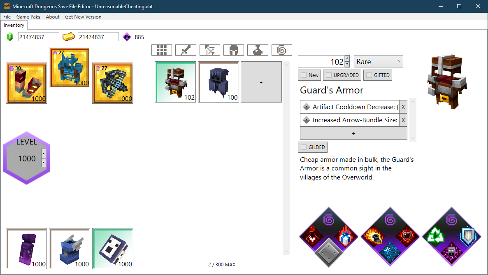

# Minecraft Dungeons - Save Editor


Edit Minecraft Dungeons character saves directly in your browser with local-only `.dat`/`.json` processing.

Use editor without downloading HERE: https://saveeditors.github.io/minecraft-dungeons-save-editor/

All editors home: https://saveeditors.github.io/



## What You Can Edit Right Now
- Character level (XP-backed) and computed total gear power.
- Currency counts: Emerald, Gold, Eye of Ender.
- Inventory and Storage Chest items.
- Equipped slots (melee, armor, ranged, 3 artifact slots).
- Item fields: type, power, rarity, marked new, upgraded, gifted.
- Enchantments and netherite (gilded) enchantment tiers.
- Armor properties (add/remove/change IDs).
- Progress stat counters and mob kill counters.
- Raw JSON fallback editor for full profile-field control.

## Not Confirmed / Not Exposed Yet
- Full game-pak extracted icon/name localization parity in browser mode.
- Auto-discovery of all hidden/unknown fields beyond JSON model + raw editor.
- Tower-specific workflows from future game updates unless mapped in current save shape.

## Quick Start
```powershell
# Open index.html directly, or host with any static server
# Example with Python:
python -m http.server 8080
```

Then open `http://localhost:8080` and load your `.dat` or `.json` save.

## Save Paths
Typical defaults:
- Steam / Launcher / Microsoft Store (Windows):
  - `%USERPROFILE%\Saved Games\Mojang Studios\Dungeons\<account-id>\Characters`
- Main save file pattern:
  - `*.dat` (one file per character)

## Notes
- Editor runs fully client-side in browser; no server upload path.
- Export supports encrypted `.dat` and readable `.json`.
- Close the game and cloud sync before editing, then relaunch after save.
- Keep backups before writing risky ID/structure edits.

What this does not do yet: it does not auto-load your installed game pak assets to rebuild every in-game icon/string table in-browser.